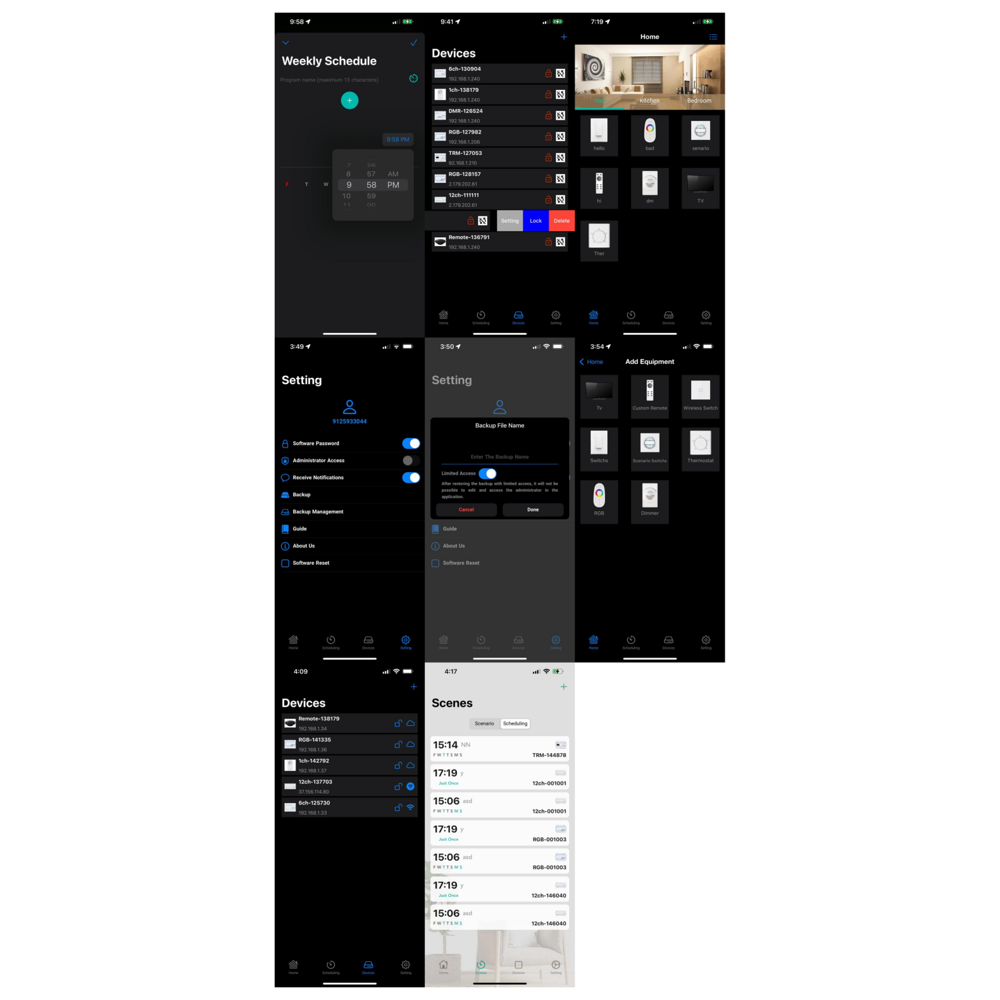

# Radkit - Remote Object Control App 🚀

## Project Overview
The **Radkit** app is an intelligent solution for controlling home appliances and connected objects over a local network and the internet. This project is developed using **Swift** in the **Xcode** environment. The app allows device control through both **Local Network (TCP/UDP)** and **MQTT**.

## Features & Technical Aspects ⚙️

- **Local Network Communication**: Control smart devices using **TCP/UDP**.
- **MQTT Communication**: Supports **MQTT** protocol for remote control over the internet.
- **Communication Protocols**:
  - **TCP/UDP**: Direct connection with smart devices within a local network.
  - **MQTT**: Secure and stable communication for sending and receiving control commands via the internet.
  - **Supports hardware modules developed by Radkit**.
- **Scheduling System**:
  - Ability to define **scenarios** for controlling multiple devices simultaneously.
  - **Weekly scheduling** feature to automatically send commands at predefined times.
- **Support for Various Devices**:
  - **Different remote controls**, including **air conditioners, TVs, and custom remotes**.
  - **Wireless and relay switches**.
  - **Dimmer and RGB controllers**.
  - **Thermostats**.
  - **CCTV cameras** with live streaming capability.
- **Room & Device Management**:
  - Create, edit, and delete rooms.
  - Add and remove devices within each room.
- **Backup & Recovery**:
  - Save configuration settings, scenarios, and devices to the cloud for quick recovery.

## How It Works 🔧

### 1. Local Network Device Control 🌐
The app utilizes **TCP and UDP protocols** to establish a direct connection with smart devices on a local network. This communication works solely within the **Wi-Fi** network without requiring internet access.

### 2. Remote Control via MQTT 🔗
For remote control (outside the local network), **MQTT protocol** is used, ensuring a stable and secure connection for sending and receiving control messages over the internet.

### 3. Scheduling & Scenario System 📅
The app includes a **time-based scheduling and scenario** system that enables users to automate commands at predefined times.

## Developers & Contributors 👨‍💻
- **Software Development**: This project was developed by me.
- **Hardware Modules**: Developed by **Radkit**.

## Related Links 🔗
- **Official Website**: [imaxbms.com](https://imaxbms.com/)
- **Download on App Store**: [RadBMS on App Store](https://apps.apple.com/us/app/radbms/id1599735488)

## Screenshots 📸
(Sample app screenshots will be placed here)

1. 
2. 

---

⚠️ **Note**: This project has been uploaded as a **demo version** to showcase the app's capabilities as part of a **personal portfolio** and is not the final product. 🎯